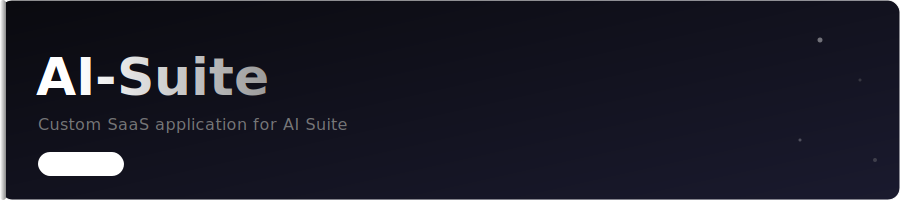

# 🧠 AI Education & Career Suite

A professional, enterprise-grade dashboard that aggregates 30+ specialized AI agents and tools for educational institutions, recruitment platforms, and academic research.

## 🚀 Overview

The **AI Education Suite** is a unified platform designed to showcase and deploy a wide range of AI-powered solutions, from automated exam grading to intelligent career coaching. Built with **Next.js 15**, **Tailwind CSS**, and **Framer Motion**, it provides a stunning, high-performance interface for managing a disparate collection of AI micro-services.

## ✨ Featured Tools

### 🎓 Exams & Assessment
- **Exam Checker AI**: Automated analysis and scoring of handwritten or digital exam papers.
- **Exam Developer**: Generate Bloom's Taxonomy based examinations from any source material.
- **Code Similarity Check**: NLP-based plagiarism and code pattern matching.
- **Exam Paper Checker**: Comprehensive validation of academic rigor and formatting.

### 💼 Career & Recruitment
- **Intelligent Job Matcher**: AI-driven matching between resume data and live market job postings.
- **Resume Analyzer AI**: Deep analysis of resume strength, skill gap, and ATS optimization.
- **Mock Interview AI**: Simulated behavioral and technical interviews with real-time feedback.
- **Resume Enhancement**: Automated suggestions for professional profile optimization.

### 📚 Study & Academic Support
- **University Chat Bot**: RAG-powered campus assistant for student services.
- **Education Book Generator**: Transform outlines into full-length structured educational books.
- **Tutorial Fetcher**: Automated discovery and curation of online learning resources.
- **Student Ethics Classifier**: AI monitoring for academic integrity and safety.

## 🛠️ Tech Stack

- **Framework**: Next.js 15 (App Router)
- **Styling**: Tailwind CSS 4
- **Animations**: Framer Motion
- **Icons**: Lucide React
- **Deployment**: Vercel & Docker

## 📦 Getting Started

1. **Install Dependencies**
   ```bash
   npm install
   ```

2. **Start Development Server**
   ```bash
   npm run dev
   ```

3. **Explore Dashboard**
   Navigate to `http://localhost:3000` to see the complete tool catalog.

## 📁 Project Structure

```
ai-suite/
├── app/                    # Dashboard pages and API routes
├── components/            # Reusable UI components (Glassmorphism)
├── lib/                   # Tool metadata and filtering logic
└── public/               # Static assets and branding
```

## 📄 License

This project is licensed under the MIT License - see the [LICENSE](LICENSE) file for details.

---

**Built by the Professional AI Outsource Team** 📡🛰️🌎